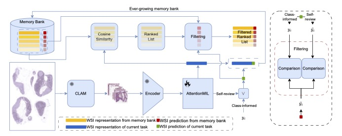

# CLEAR-WSI
### Foundation Model Empowered Whole Slide Image Retrieval
[Paper](https://openreview.net/forum?id=gUirdyBi4f)



# Datasets
### Slide Level
1) [CAMELYON16](https://camelyon16.grand-challenge.org/)
2) [BRACS](https://www.bracs.icar.cnr.it/)
### Patch Level
1) [MHIST](https://bmirds.github.io/MHIST/)
2) [NCT-CRC-HE-100K](https://zenodo.org/records/1214456)

# Models
1) [DeiT](https://github.com/facebookresearch/deit)
2) [MoCo-V3](https://github.com/facebookresearch/moco-v3)
3) [Prov-GigaPath](https://github.com/prov-gigapath/prov-gigapath)
4) [UNI](https://github.com/mahmoodlab/UNI)

# Results
### WSI Retrieval Performance: Acc<sub>MV</sub> ↑ and NDCG ↑ (@k = 1, 3, 5)

| @k | Pipeline | CAMELYON16 (NDCG \| Acc<sub>MV</sub>) | BRACS-1 (NDCG \| Acc<sub>MV</sub>) | BRACS-2 (NDCG \| Acc<sub>MV</sub>) |
|---|----------|------------------------------|---------------------------|---------------------------|
| **1** | Yottixel-K (SOTA) | 76.21 \| 75.96 | 49.91 \| 49.41 | 33.61 \| 32.94 |
|  | CLEAR-WSI (SR DeiT*) | 69.30 \| 68.99 | 52.20 \| 51.72 | _38.93 \| 37.93_ |
|  | CLEAR-WSI (SR MoCov3*) | 67.00 \| 66.67 | _54.48 \| 54.02_ | 28.30 \| 27.59 |
|  | CLEAR-WSI (SR Prov-GigaPath) | 73.14 \| 72.87 | 51.06 \| 50.57 | 30.58 \| 29.89 |
|  | CLEAR-WSI (CI UNI) | **96.93 \| 96.90** | 43.87 \| 43.68 | 10.53 \| 10.34 |
|  | CLEAR-WSI (SR UNI) | _90.02 \| 89.92_ | **67.00 \| 66.67** | **44.24 \| 43.68** |
| **3** | Yottixel-K (SOTA) | 74.59 \| 78.29 | 49.58 \| _54.12_ | 31.25 \| _36.47_ |
|  | CLEAR-WSI (SR DeiT*) | 65.45 \| 67.44 | 51.47 \| 52.87 | 32.56 \| 34.48 |
|  | CLEAR-WSI (SR MoCov3*) | 67.10 \| 72.09 | _54.45_ \| 50.47 | 28.81 \| 25.28 |
|  | CLEAR-WSI (SR Prov-GigaPath) | 67.99 \| 71.32 | 51.20 \| 49.43 | _33.18 \| 35.63_ |
|  | CLEAR-WSI (CI UNI) | **97.69 \| 99.22** | 42.02 \| 45.98 | 11.24 \| 16.09 |
|  | CLEAR-WSI (SR UNI) | _89.56 \| 89.15_ | **66.82 \| 72.41** | **44.94 \| 48.28** |
| **5** | Yottixel-K (SOTA) | 73.69 \| 77.49 | 48.64 \| 54.12 | 29.17 \| 36.47 |
|  | CLEAR-WSI (SR DeiT*) | 65.84 \| 70.54 | 51.44 \| 57.47 | 31.48 \| 36.78 |
|  | CLEAR-WSI (SR MoCov3*) | 67.07 \| 72.87 | _55.30 \| 62.07_ | 28.99 \| 29.89 |
|  | CLEAR-WSI (SR Prov-GigaPath) | 65.99 \| 65.89 | 52.18 \| 54.02 | _32.42 \| 36.78_ |
|  | CLEAR-WSI (CI UNI) | **97.23 \| 98.93** | 41.39 \| 50.57 | 11.46 \| 14.94 |
|  | CLEAR-WSI (SR UNI) | _89.07 \| 89.92_ | **66.98 \| 75.86** | **43.19 \| 51.72** |

### Patch Retrieval Performance: NDCG ↑ (@k = 5)

| @k | Pipeline | MHIST (NDCG) | CRC-VAL-HE-7K (NDCG) 
|---|----------|------------------------------|---------------------------|
| **5** | CLEAR-WSI (SR DeiT*) | 96.59 | 86.34 |
|  | CLEAR-WSI (SR MoCov3*) | 98.42 | 95.87 |
|  | CLEAR-WSI (SR UNI) | 94.31 | 99.95 |

# Authors and acknowledgment
```bibtex
@inproceedings{wallyclear,
  title={CLEAR-WSI: Towards Foundation Model Empowered Diagnosis Aligned Whole Slide Image Retrieval},
  author={Wally, Youssef and Liu, Jingsong and Li, Han and Zhou, Weiwei and Dai, Jing and Wetzer, Elisabeth and Sch{\"u}ffler, Peter J},
  booktitle={MICCAI Workshop on Computational Pathology with Multimodal Data (COMPAYL)}
}
```
